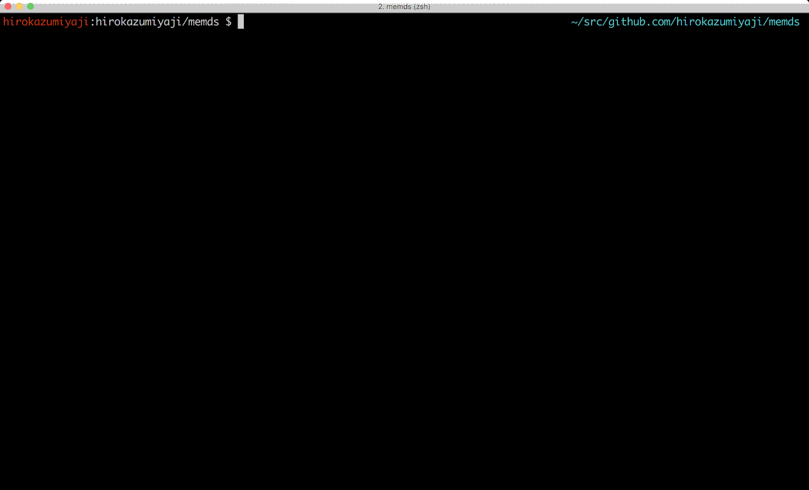

# Memds
OnMemory Key Value Store

## Build

```bash
$ cd  $GOPATH/src/github.com/hirokazumiyaji/memds
$ make all-build
```

## Command

### get

```
get <key>
```

### set

```
set <key> <value>
```

### del

```
del <key>
```

## Example

### Server



### Client


